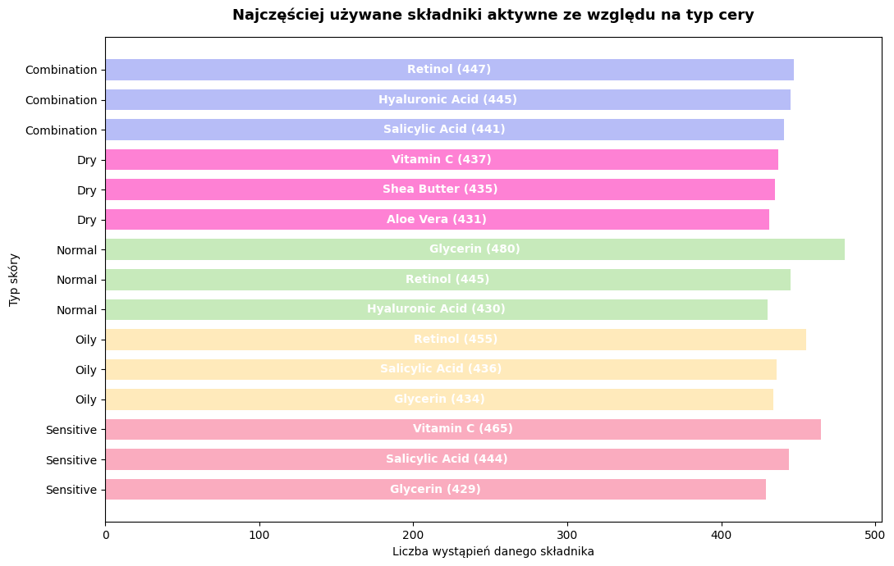

# Top_Beauty
Analiza danych dotyczących produktów kosmetycznych

Źródło: Kaggle 

Link: https://www.kaggle.com/datasets/waqi786/most-used-beauty-cosmetics-products-in-the-world

Cel: 
- ** analiza topowych produktów i preferencji konsumentów
- ** analiza korelacji między ceną produktu, a ocenami klientów 
- ** sprawdzenie trendu etycznego testowania kosmetyków oraz wskazanie głównych składników w produktach względem określonych kryteriów. 
- ** Insight dla biznesu pokazujący trendy i preferencje.

IDE: Python

Biblioteki: Matplotlib, Seaborn, Pandas, Numpy, 

Kod: całość z komentarzami do pobrania w osobnym pliku .py

### 📊 Wersja pierwsza: TopBeauty.py (06.03.2026)

### 🔍🔍 Wersja rozszerzona: TopBeauty.py (06.06.2026)* 
wersja poprawiona i rozszerzona o dodatkową analizę - podsumowanie kolejnych szkoleń i nowo nabytych umiejętności. Informacje co zostało zmnienione na dole*

insights:
- ** --> Nie ma korelacji między ceną produktu, a pozytywnymi opiniami klientów
- ** --> klienci najlepiej oceniają produkty z kategorii Contour, Moister, CC Cream,
- ** --> Typ opakowania produktu, a targetowanie produktu według płci nie wskazuje zbyt dużych różnic, poza opakowaniem typu Stick. Dlaczego tak jest? 
Otóż ten typ opakowania, jest związany z pomadkami, a te z kolei w większości dedykowane są dla kobiet :-)
-** --> Wśród najlepiej ocenanych produktów dla osób ze skórą wrażliwą, w top5 znalzały się aż 4 produkty do ust. Dlaczego? Usta (wywyinięta śluzówka) 
są mniej skłonne do alergii przy stosowaniu kosmetyków działających powierzchniowo. 
- ** --> Nie ma lidera wśród etycznego produkowania kosmetyków. Każdy z krajów na zbliżoną ilość procentową dla etycznych produktów i wynosi ok 12%. 

### Wersja rozszerzona:
- ** --> wzbogacenie o dodatkowe wykresy - stacked bar chart, heatmap
- ** --> ujednolicenie szaty kolorystycznej o własną paletę barw
- ** --> dodanie nowych wniosków i pytań
- ** --> przygotowanie pełnenj prezentacji w JupiterNotebook

### Przykładowe wizualizacje i kod:

### 📊 Wersja pierwsza: TopBeauty.py (06.03.2026)

### 🔍🔍 Wersja rozszerzona: TopBeauty.py (06.06.2026)*
![kod1] (kod_1.png?v=1)

![kod1] (kod_2.png?v=1)

![kod_extened] 

